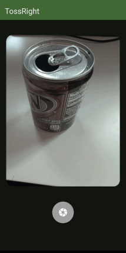

# TossRight: Waste classifier and disposal instructions

# Overview
TossRight is a mobile application that is able to image waste, classify what it is, and give you instructions for the best method of disposing of that item. All images taken with the app are uploaded to a server to improve the computer vision model.

### Notices
> [!IMPORTANT]
> Images taken with this app WILL be uploaded to a server to be used to further train the model. An opt-out/opt-in will be provided in the near-future, but is not implemented. There is no way to delete these images once sent to the server, as there is no way to trace them back to you. Track status on issue [#1](https://github.com/SudoWatson/tossright-app/issues/1) for updates to this. One of the primary purposes of this app is to be a crowdsourced approach to creating an open Waste Identification model to be used by others.

> [!WARNING]
> The model is not 100% accurate and will often give incorrect results. Please provide feedback using the available buttons when this happens to improve the model and make it more accurate. Every image helps.

> [!NOTE]
> The model is trained on images of a white background. It will provide the best results if your image is taken in front of a mostly white background, but still is subject to inaccuracies mentioned above. I do suggest taking images in-front of non-white backgrounds and providing feedback on them so the model can be trained on my backgrounds and be more useful. It is unlikely to work well on a noisy background regardless though.

## Installation
The app is in the process of being published to app repositories like F-Droid and Google Play Store. Android users can follow the **Develop** instructions to load the application. Since I don't own any Apple devices, I am unable to publish it to the Apple App Store.

## Develop
- Ensure you have the Flutter SDK installed
- Clone the GitHub repo with `git clone https://github.com/SudoWatson/waste-project-app.git`
- Move into the folder with `cd waste-project-app`
- Run `flutter pub get`
- Enable Developer Options on your Android device and plug it into your computer via USB
- Run `flutter run`
The application should be installed and start on your device.

## Computer Vision Model
The app currently uses a TensorFlow model trained on the TrashNet dataset. Images taken with the app will be uploaded to a server (source coming soon) to be used to train more accurate vision models.## Roadmap

- [ ] Publish app to Android repositories.
- [ ] Allow using the app without uploading images and feedback
- [ ] Expand common classification types
    - [ ] Batteries
    - [ ] Flexible Plastics
    - [ ] Compost
    - [ ] E-Waste
    - [ ] Etc.
- [ ] Allow users to annotate incorrectly classified images in feedback
- [ ] User accessible history/statistics

## Recycling

Today, 1 in 4 items placed in the single stream recycling bin are not recyclable, causing contamination. This kind of contamination will lead to entire trucks full of "recycling" to be redirected to landfills. Additionally, 76% of all recyclable material is thrown out at the household level, contributing to only 9% of plastics being recycled, and only about a third of all recyclable material actually getting recycled, despite this system being in use for over 60 years.

There are many other problems with the recycling system, this app is not meant to be a solution, but an assistance, and to develop a computer vision model that can be used in other ideas to help fix the system.
